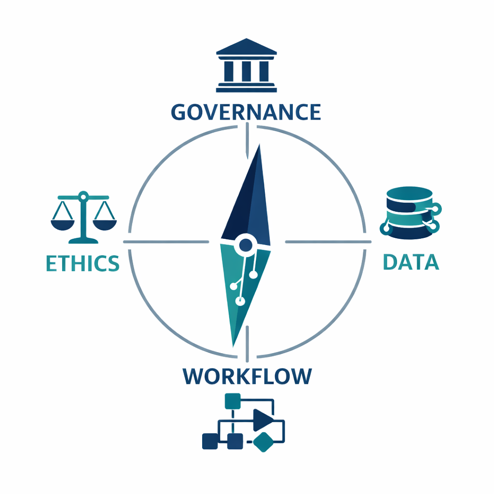
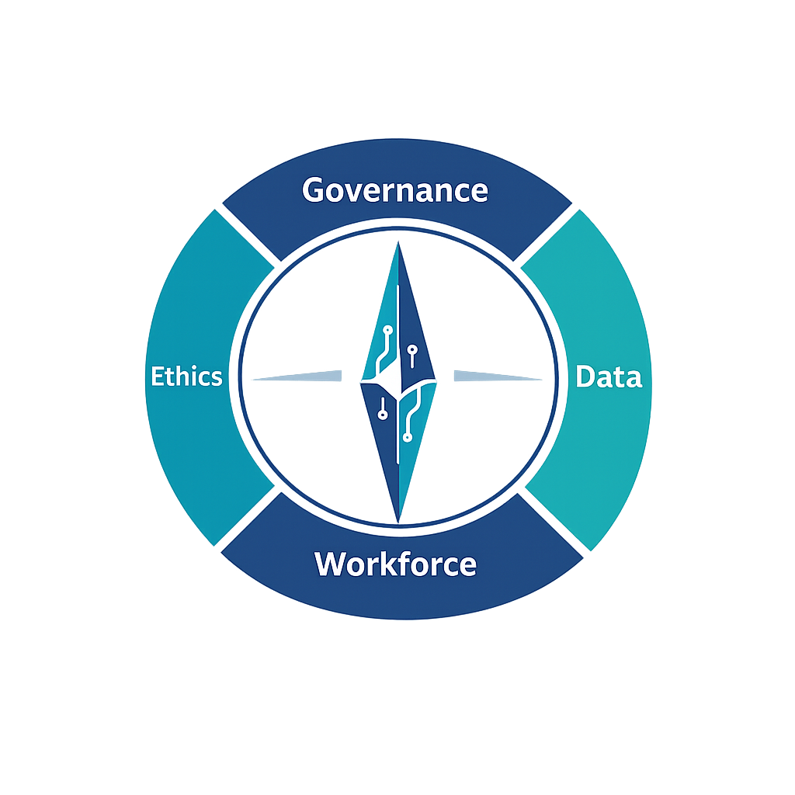
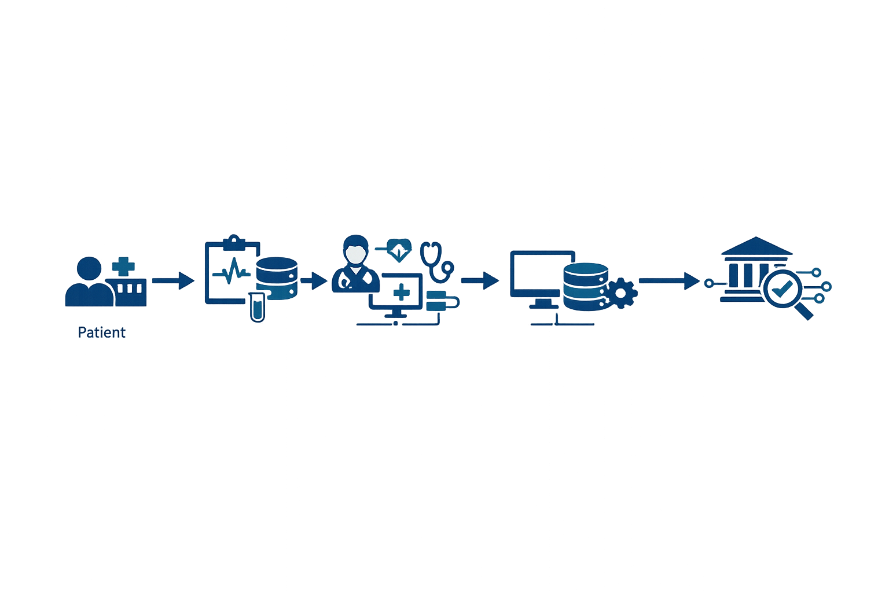

# Healthcare AI Readiness Compass (HCAIC)



*Open‑source diagnostic framework for governance, workflows, and digital maturity in healthcare AI adoption, integration and implementation.*

A diagnostic framework built by health systems leaders, for health systems leaders.  
Practical, transparent, and designed to measure governance, workflow integration, and digital maturity in healthcare AI adoption.

---

## Purpose
Healthcare organizations face pressure to adopt AI without clear benchmarks.  
The Compass provides a structured assessment that identifies strengths, gaps, and priorities for safe and effective implementation.

HCAIC complements emerging standards such as **ISO/IEC 42001** by providing a healthcare‑specific diagnostic framework. While ISO 42001 defines requirements for AI management systems across industries, HCAIC translates those principles into practical tools for health systems leaders.

---

## Overview
The Healthcare AI Readiness Compass (HCAIC) is an open‑source diagnostic framework designed to help health systems, organizations, and leaders assess their preparedness for AI adoption.  
It provides a structured lens across four domains: **Governance, Data, Workflow, and Ethics**.

Created by **Leigh** — systems architect and former WHO, NHS, and NSW Health leader — HCAIC translates institutional expertise into practical, regenerative tools for digital maturity.

---
## Key Features

### Governance & Compliance
- Transparent readiness criteria  
- Evaluation modules for policy alignment  

### Workflow & Automation
- Pathway analysis: data flows, patient journeys, task audits  
- Workflow mapping diagrams to visualize patient, data, and system flows  

### Digital Maturity
- Scoring outputs with traffic‑light benchmarks  
- Templates and toolkits for immediate application
 


**Visual Tools**
- **Compass Framework**: quadrant model aligning governance, data, workflow, and ethics  
- **Readiness Scorecard**: quick diagnostic benchmarking tool  
- **Workflow Diagram**: end‑to‑end pathway illustration  


---
## Audience
- Health system executives and commissioners  
- Clinical leaders and educators  
- IT and digital transformation teams  
- Policy and governance bodies  

---

## Why It Matters
**Without readiness, AI adoption risks becoming expensive hype rather than sustainable transformation.**  
The Compass provides clarity, direction, and a common language for decision‑making, ensuring AI adoption strengthens governance, workflows, and patient outcomes.

---

## How to Use
1. **Clone or download the repository**:
   ```bash
   git clone https://github.com/HCAIC/healthcare-ai-readiness-compass.git
